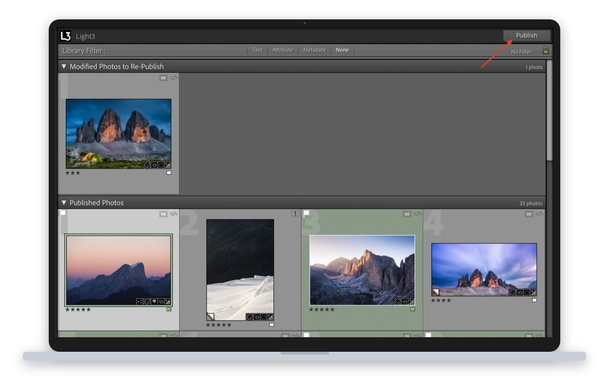
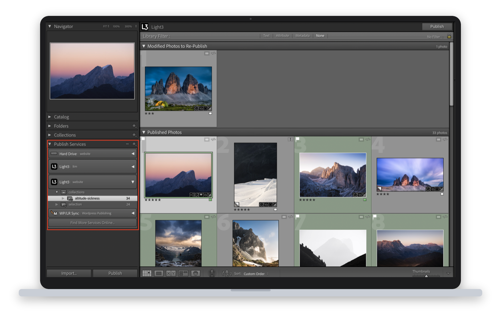
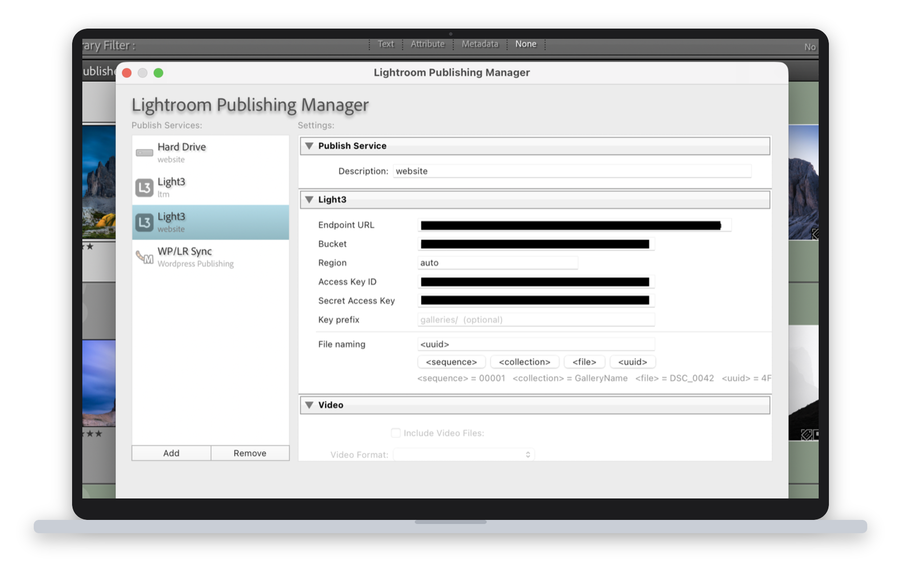

<p align="center">
  
</p>

<h1 align="center">Light3</h1>

<p align="center"><strong>Publish from Lightroom Classic straight to S3-compatible storage.</strong></p>

<p align="center">
  Your catalogue becomes the image backend for a static site — in exactly the order you arranged it,<br />
  with credentials that never leave your Mac.
</p>

<p align="center">
  <a href="https://github.com/thkleinert/Light3/releases/latest"><strong>Download</strong></a> &nbsp;·&nbsp;
  <a href="#installation">Install</a> &nbsp;·&nbsp;
  <a href="#setting-up-a-publish-service">Set up</a> &nbsp;·&nbsp;
  <a href="#troubleshooting">Troubleshooting</a>
</p>

<p align="center">
  
</p>

---

## Why Light3

A static site generator is a fine way to *publish* photographs and a poor way to *manage* them. Your catalogue already knows which frames are worth showing, how they group together, and what order they belong in. Getting that out of Lightroom normally means exporting to a folder, renaming files, uploading them somewhere, and then hand-maintaining a list of what goes where.

Light3 deletes that middle step. Photos go from a published collection to your bucket, and a manifest records which photos each collection holds and in what sequence — so your build can reproduce the arrangement you made in Lightroom, without you describing it twice.

- **Curate where you already are.** Drag to reorder, add, remove. Hit Publish.
- **Only what changed moves.** Lightroom tracks what is current; edits re-upload, everything else is skipped.
- **Credentials stay on your machine.** Signing runs through a bundled local helper — no proxy, no intermediary service, no keys in the plugin.

Works with **Cloudflare R2**, **AWS S3**, **Backblaze B2**, **MinIO**, and any other S3-compatible endpoint. This README is written for people who want to install and run it.

---

## Contents

- [Why Light3](#why-light3)
- [Overview](#overview)
  - [Architecture](#architecture)
- [Requirements](#requirements)
- [Installation](#installation)
  - [1. Download the plugin](#1-download-the-plugin)
  - [2. Install the Lightroom plugin](#2-install-the-lightroom-plugin)
- [Setting up a Publish Service](#setting-up-a-publish-service)
- [Publishing photos](#publishing-photos)
  - [Collections and collection sets](#collections-and-collection-sets)
  - [Storage layout](#storage-layout)
    - [Switching an existing service to flat storage](#switching-an-existing-service-to-flat-storage)
  - [File naming](#file-naming)
  - [Sort order](#sort-order)
    - [Pushing a new order without re-uploading](#pushing-a-new-order-without-re-uploading)
  - [Re-publishing](#re-publishing)
  - [Removing photos](#removing-photos)
- [Provider-specific setup](#provider-specific-setup)
  - [Cloudflare R2](#cloudflare-r2)
  - [AWS S3](#aws-s3)
  - [Backblaze B2](#backblaze-b2)
- [File structure](#file-structure)
- [Troubleshooting](#troubleshooting)
- [Development](#development)
  - [Reloading the plugin in Lightroom](#reloading-the-plugin-in-lightroom)
  - [Building the signing helper locally](#building-the-signing-helper-locally)
  - [Releases](#releases)
  - [Contributing](#contributing)

---

## Overview

Light3 adds a **Publish Service** to Lightroom Classic. You organise photos into published collections; hitting **Publish** uploads them to your S3 bucket. Removing a photo from a collection deletes it from the bucket. Lightroom tracks which photos are up-to-date and only re-uploads changed ones.

### Architecture

Lightroom's scripting environment (Lua) has no native crypto, so AWS Signature V4 signing can't be done inside the plugin. Light3 solves this with a two-part design:

```
Lightroom (Lua plugin)
  │
  │  calls
  ▼
light3.lrplugin/light3-sign   ← signing helper bundled in the plugin
  │
  │  returns presigned URL (already signed, no auth headers needed)
  ▼
S3-compatible bucket          ← plain HTTP PUT via curl, no credentials in Lua
```

The signing helper runs locally — your credentials never leave your machine.

---

## Requirements

- **macOS** (the signing helper binary is macOS-only; Windows/Linux are untested)
- **Lightroom Classic** 6 or later
- An S3-compatible bucket (Cloudflare R2, AWS S3, etc.)

---

## Installation

### 1. Download the plugin

Go to the [Releases page](https://github.com/thkleinert/Light3/releases) and download the latest `light3-vX.Y.Z.lrplugin.zip`. Unzip it — you'll get a `light3.lrplugin` folder with the signing helper already bundled inside.

### 2. Install the Lightroom plugin

<p align="center">
  
</p>

Option A — copy to the standard plugins folder:

```bash
cp -r light3.lrplugin \
  ~/Library/Application\ Support/Adobe/Lightroom/Modules/
```

Option B — symlink (easier to update):

```bash
ln -s "$(pwd)/light3.lrplugin" \
  ~/Library/Application\ Support/Adobe/Lightroom/Modules/light3.lrplugin
```

Option C — add manually in Lightroom:
**File → Plug-in Manager → Add** → select the `light3.lrplugin` folder.

Restart Lightroom after installing.

---

## Setting up a Publish Service

<p align="center">
  
</p>

1. Open the **Library** module.
2. In the **Publish Services** panel (left sidebar), find **Light3** and click **Set Up…**
3. Fill in the connection settings (see table below).
4. Click **Save**.

| Field | Description | Example |
|---|---|---|
| Endpoint URL | Base URL of your S3-compatible service | `https://abc123.r2.cloudflarestorage.com` |
| Bucket | Bucket name | `my-photos` |
| Region | AWS region or `auto` for R2 | `auto` |
| Access Key ID | S3 access key | `abc123def456` |
| Secret Access Key | S3 secret key | (hidden) |
| Key prefix | Optional path prefix inside the bucket | `photos/` |
| File naming | Template for S3 filenames (see below) | `<sequence>_<collection>` |

---

## Publishing photos

### Collections and collection sets

Create collections and optionally group them in collection sets. Light3 mirrors the full hierarchy as S3 path segments:

```
<bucket>/<prefix>/<CollectionSet>/.../<Collection>/<filename>
```

For example, with collection set `Weddings` and collection `Smith 2026`:

```
my-photos/Weddings/Smith_2026/00001_Smith_2026.jpg
```

### Storage layout

By default Light3 mirrors the collection hierarchy as S3 path segments, and writes each collection's `order.json` alongside its images. A photo belonging to two collections is uploaded twice, to two prefixes.

Tick **Store all images in one prefix (flat)** to keep a single copy of every photo instead:

```
nested (default)                      flat
  Collections/Metropolitan/             images/
    <uuid>.jpg                            <uuid>.jpg          one object per photo
    order.json                          manifests/
                                          Collections/Metropolitan.json
```

The manifest has to move because flat images no longer say which collection they belong to — every collection would otherwise write to the same `order.json`. Its path comes from **Manifest prefix** plus the collection's position in the hierarchy, so collections and collection sets are still organised exactly as before. **Nothing changes in Lightroom.**

Flat storage suits libraries where thematic collections are curated out of larger ones, so the same photo appears in several. Besides the storage saving, it removes a consistency trap: with per-collection prefixes the same photo exists as several independent exports, and re-editing it then publishing only one collection leaves the copies silently different.

**Removing a photo behaves differently.** In flat mode a single object can back several collections, so removing a photo from a collection drops it from that collection's manifest but does **not** delete the object. Objects no longer referenced by any manifest have to be collected separately — compare the image prefix against the union of all manifests.

#### Switching an existing service to flat storage

Changing the layout changes every key, but Lightroom does not know that. It tracks each photo by the key it last published, and changing a setting marks nothing as modified.

**Publish Now will not move anything.** It rewrites the manifest from the keys Lightroom already recorded, so you end up with the manifest in its new location still pointing at the old image paths.

To actually move the images:

1. Set **Key prefix** first — something like `images/`. Flat storage drops the collection path, so with an empty prefix every photo lands at the bucket root, mixed in with your existing prefixes.
2. Select every photo in the collection, right-click, **Mark to Republish**.
3. Click **Publish**. The photos are re-rendered, uploaded under the new keys, and Lightroom records them.

The objects at the old prefix are left in place. Nothing references them once the manifest is rewritten, so remove them after confirming the new layout looks right.

### File naming

The **File naming** field in the service settings is a free-form template. Click the token buttons to insert:

| Token | Resolves to |
|---|---|
| `<file>` | Original filename without extension (default) |
| `<sequence>` | Zero-padded position in the publish run, e.g. `00001` |
| `<collection>` | Sanitised collection name |

Examples:
- `<file>` → `DSC_0042.jpg`
- `<sequence>_<collection>` → `00001_Smith_2026.jpg`
- `<sequence>_<file>` → `00001_DSC_0042.jpg`

The file extension is always appended automatically.

### Sort order

Light3 supports two collection sort modes:

- **Capture Time** — photos are ordered by EXIF capture date, ascending. This is the default for most collections.
- **Custom Order** — drag-and-drop order set in Lightroom is respected exactly. Combined with the `<sequence>` token, the upload sequence matches your manual ordering precisely.

Other sort modes (file name, rating, label…) fall back to capture time order.

After every publish run, Light3 writes an `order.json` sidecar file to the collection's S3 prefix. This file contains the full ordered list of photo keys as they appear in Lightroom, so downstream consumers (galleries, websites) can display photos in the correct sequence without relying on filename sorting.

Example `order.json` for a collection at `Weddings/Smith_2026/`:

```json
{
  "collection": "Smith_2026",
  "prefix": "Weddings/Smith_2026/",
  "photos": [
    "Weddings/Smith_2026/00003_DSC_0099.jpg",
    "Weddings/Smith_2026/00001_DSC_0042.jpg",
    "Weddings/Smith_2026/00002_DSC_0077.jpg"
  ]
}
```

`order.json` is updated on every publish, including when photos are removed.

#### Pushing a new order without re-uploading

Reordering photos does not mark anything as modified, so the **Publish** button stays inactive. To push the new order, right-click the published collection and choose **Publish Now**. This runs a publish cycle with nothing to render — no image is re-uploaded — and Light3 rewrites `order.json` alone.

Avoid *Mark to Republish* for a pure reorder: it flags every photo as modified, so Lightroom re-renders and re-uploads the whole collection just to rewrite a small JSON file.

### Re-publishing

Lightroom tracks which photos have been published. If you edit a photo and re-publish, only changed photos are re-uploaded.

### Removing photos

Removing a photo from a published collection and clicking **Publish** deletes the object from the bucket.

---

## Provider-specific setup

### Cloudflare R2

1. In the Cloudflare dashboard, go to **R2 → your bucket → Settings → S3 Auth**.
2. Create an **API token** with *Object Read & Write* permissions.
3. Note your **Account ID** (visible in the R2 overview page).

| Field | Value |
|---|---|
| Endpoint URL | `https://<account-id>.r2.cloudflarestorage.com` |
| Region | `auto` |
| Access Key ID | R2 token Access Key ID |
| Secret Access Key | R2 token Secret Access Key |

### AWS S3

1. Create an IAM user with an inline policy:

```json
{
  "Version": "2012-10-17",
  "Statement": [
    {
      "Effect": "Allow",
      "Action": ["s3:PutObject", "s3:DeleteObject"],
      "Resource": "arn:aws:s3:::your-bucket-name/*"
    }
  ]
}
```

2. Create access keys for that user.

| Field | Value |
|---|---|
| Endpoint URL | `https://s3.<region>.amazonaws.com` |
| Region | `us-east-1` (or your bucket's region) |
| Access Key ID | IAM access key |
| Secret Access Key | IAM secret key |

### Backblaze B2

1. In B2, create an **Application Key** with read/write access to your bucket.
2. Note the S3-compatible endpoint shown in the bucket details.

| Field | Value |
|---|---|
| Endpoint URL | `https://s3.<region>.backblazeb2.com` |
| Region | `us-west-004` (from bucket details) |
| Access Key ID | B2 Application Key ID |
| Secret Access Key | B2 Application Key |

---

## File structure

```
Light3/
├── light3.lrplugin/
│   ├── Info.lua                # Plugin manifest
│   ├── S3PublishSupport.lua    # Publish service UI and callbacks
│   ├── S3Upload.lua            # Upload/delete via presigned URLs + curl
│   ├── S3_small.png            # Plugin icon
│   └── light3-sign             # Signing helper binary (built locally or via CI, not in git)
├── signing-helper-go/
│   ├── main.go                 # Presigned URL generator (Go / aws-sdk-go-v2)
│   ├── build.sh                # Builds universal macOS binary and installs locally
│   ├── go.mod
│   └── go.sum
└── .github/workflows/
    ├── release-please.yml      # Automates Release PRs and versioning
    └── release.yml             # Called by release-please: builds binary + attaches plugin zip
```

---

## Troubleshooting

**"Signing helper failed (exit …)"**
→ Make sure you downloaded the plugin from the [Releases page](https://github.com/thkleinert/Light3/releases) — the zip includes the pre-built `light3-sign` binary. If you cloned the repo directly, build the binary manually (see **Contributing** below).

**HTTP 403 on upload**
→ The presigned URL was generated but the bucket rejected it. Check:
- Credentials have write permission on the bucket
- Endpoint URL is correct (no trailing slash)
- For R2: the S3-compatible API is enabled on the bucket

**HTTP 404 on upload**
→ The bucket does not exist or the endpoint URL is wrong.

**Photos keep showing as "modified" after publish**
→ Lightroom tracks publish state via the S3 key. If the key prefix, collection name, or file naming template changes between publishes, Lightroom loses track of already-published photos. Avoid changing these settings after the first publish.

---

## Development

### Reloading the plugin in Lightroom

After editing `.lua` files:
**File → Plug-in Manager → select Light3 → Reload Plug-in**

No Lua build step is required.

### Building the signing helper locally

Requires Go 1.22+.

```bash
cd signing-helper-go
bash build.sh --install
```

This builds a universal macOS binary (`dist/light3-sign`) and copies it to both `light3.lrplugin/` and your Lightroom Modules directory. The binary is not checked into git — it is built by the release pipeline and bundled into the release zip automatically.

### Releases

Releases are automated via [release-please](https://github.com/googleapis/release-please). Use [conventional commits](https://www.conventionalcommits.org/) when merging to `main`:

| Prefix | Effect |
|---|---|
| `feat:` | minor version bump |
| `fix:` | patch version bump |
| `feat!:` / `BREAKING CHANGE:` | major version bump |
| `chore:`, `docs:`, `test:` | no version bump |

release-please opens a Release PR automatically. Merging it creates the tag and GitHub release. The release workflow then builds the universal binary and attaches `light3-vX.Y.Z.lrplugin.zip` to the release.

### Contributing

Pull requests welcome. Keep the signing helper dependency-light (only `aws-sdk-go-v2` packages) and the Lua code compatible with Lightroom Classic SDK 5+.
